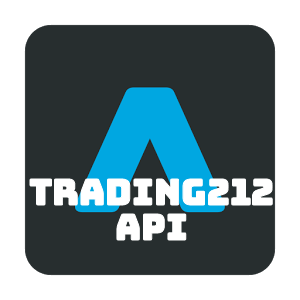

# Trading212-API
> API for Trading212 broker service

[](https://github.com/federico123579/Trading212-API/releases) [](https://pypi.python.org/pypi?name=trading212api) [](https://pypi.python.org/pypi?name=trading212api)

A python user-interface for Trading 212 using browser automation.

## Installing / Getting started

To install the API, just install it with pip.

```shell
pip install trading212api
python trading212api
```

## Developing

### Built With

- python _v.3.6_

#### Libraries

- splinter _v.0.7.6_

Built with *splinter* for a better browser automation.

### Prerequisites

The dependencies for dev instances are:
- splinter _v.0.7.6_
- geckodriver _(for Firefox)_
- chromedrive _(for Chrome)_

### Setting up Dev

Here's a brief intro about what a developer must do in order to start developing
the project further:

```shell
git clone https://github.com/your/your-project.git
cd your-project/
python3.6 -m venv env
. env/bin//activate
pip install splinter bs4
```

### To-do

[ ] add real account login

## Versioning

The Semantic Versioning is used in this repository in this format:

    [major].[minor].[patch]-{status}

* **major** indicates incopatible changes
* **minor** indicates new features
* **patch** indicates bug fixies
* **status** show the status (alpha, beta, rc, etc.)

for more information see [Semantic Versioning](http://semver.org/)

## Configuration

As soon the program is launched it requires some user data:
- username
- password

## Api Reference

REQUIRED - **SOON**

## Licensing

This software is under the MIT license.